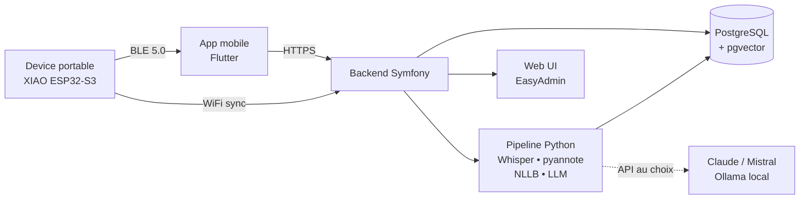

# Skald

> Compagnon IA portable, open source, sans abonnement.
> Capture audio (et bientôt visuelle) du quotidien, traitement local ou via l'IA de votre choix.

[](LICENSE)
[](firmware/)
[](backend/)
[](pipeline/)

---

## Pourquoi ce projet

Les dictaphones IA du marché (Plaud Note, Limitless Pendant, Omi) ont un défaut commun : ils dépendent d'un abonnement pour exploiter leurs propres données. Vous payez un device, vous payez ensuite pour transcrire ce que vous avez vous-même enregistré, sur des serveurs étrangers, avec le modèle imposé par le fabricant.

**Skald** propose l'inverse :

- Matériel basé sur des composants standards (ESP32-S3), entièrement documenté
- Firmware libre, conforme aux principes de l'embarqué économe
- Pipeline de traitement local ou hybride, **vous choisissez votre IA** (Ollama, Claude, Mistral, GPT, Gemini)
- Aucune télémétrie, aucun abonnement, aucune dépendance à un cloud propriétaire
- Conçu en conformité RGPD et avec une exigence forte d'éthique de captation

Skald est nommé d'après les poètes norrois transmetteurs de mémoire orale. L'objet ne sert pas à surveiller, mais à se souvenir et à comprendre.

---

## Architecture



Skald est un monorepo regroupant **six composants indépendants** mais conçus pour fonctionner ensemble. Chacun peut être utilisé seul (par exemple : pipeline Python sans device, pour traiter des enregistrements existants).

---

## Composants

| Dossier | Rôle | Stack |
|---|---|---|
| [`firmware/`](firmware/) | Code embarqué du device portable | C++ / PlatformIO / Arduino Core ESP32 |
| [`mobile/`](mobile/) | App compagnon (provisioning WiFi, sync, contrôle) | Flutter |
| [`backend/`](backend/) | API REST, gestion utilisateurs, archive | Symfony 7 / PHP 8.2 / EasyAdmin 4 |
| [`pipeline/`](pipeline/) | Workers de traitement audio (STT, diarisation, traduction, résumé) | Python 3.12 / FastAPI / Celery |
| [`hardware/`](hardware/) | Schémas PCB, fichiers STL, BOM | KiCad 8 / Fusion 360 |
| [`docs/`](docs/) | Documentation utilisateur, tutoriels, modèles juridiques | Markdown / VitePress |

---

## Cas d'usage couverts

- **Capture passive** : enregistrement d'une réunion, d'une conférence, d'une consultation, avec transcription et résumé asynchrone (équivalent open source d'un Plaud Note).
- **Journal sonore** : capture épisodique d'idées, monologue de réflexion, dictée ; classement automatique par horodatage et géolocalisation.
- **Traduction différée** : enregistrement multilingue, transcription dans la langue d'origine, traduction et résumé dans la langue cible.
- **Mémoire augmentée pour formateur·rice** : capture de sessions, recherche full-text dans l'archive personnelle, citation de passages précis.
- **Matière première autobiographique** : alimentation continue d'un journal pour un projet d'écriture long.

### À venir (roadmap)

- Identification des interlocuteurs après enrôlement consenti (pyannote + ECAPA-TDNN)
- Variante avec micro-caméra pour augmentation contextuelle
- Mode quasi temps réel pour traduction live (Moshi STT + Piper TTS)
- Agent proactif optionnel (détection de langue étrangère, détection de question directe)

---

## Spécifications matérielles (v1)

| Composant | Référence | Coût indicatif |
|---|---|---|
| Microcontrôleur | Seeed XIAO ESP32-S3 Sense | 15 € |
| Batterie | LiPo 502025 avec BMS, 200 mAh | 5 € |
| Capteur touch | Pad cuivre + GPIO capacitif natif ESP32 | 0 € |
| LED indicateur | SMD 0805 + résistance 470 Ω | 0,10 € |
| Boîtier | Impression 3D PETG, design ouvert | ~2 € matière |
| **Total BOM** | | **~22 €** |

Le device offre :
- BLE 5.0 et Wi-Fi 2,4 GHz
- Micro PDM intégré (extensible en I²S multi-micros)
- Slot microSD jusqu'à 32 Go
- Caméra OV2640 optionnelle (détachable)
- Touch capacitif natif ESP32 (réveil depuis deep sleep)
- Autonomie cible : 8 h en usage mixte, 60 jours en veille

---

## Stack logicielle

### Firmware
- ESP-IDF / Arduino Core ESP32
- FreeRTOS pour le multitâche
- ArduinoBLE pour le pairing
- Mise à jour OTA via Wi-Fi

### Backend
- Symfony 7 / PHP 8.2
- EasyAdmin 4 pour l'administration
- API Platform 4 pour les endpoints REST/JSON
- Doctrine ORM / PostgreSQL 16 + pgvector pour la recherche sémantique
- Mercure pour les notifications temps réel device → web

### Pipeline IA
- **STT** : faster-whisper (par défaut), Moshi STT en option
- **Diarisation** : pyannote.audio 3.x
- **Traduction** : NLLB-200 ou LLM contextualisé
- **Résumé / extraction** : LLM au choix (provider abstrait via une interface)
- **Embeddings** : sentence-transformers pour la recherche sémantique

### Choix du fournisseur LLM
Skald n'impose aucun fournisseur. Le pipeline expose une interface `LLMProvider` qui supporte :
- Ollama (local, recommandé pour confidentialité totale)
- Anthropic Claude (API)
- Mistral La Plateforme (API, hébergement européen)
- OpenAI GPT (API)
- Tout endpoint compatible OpenAI

Configuration dans `pipeline/config.yaml`.

---

## Démarrage rapide

### Prérequis

- Python 3.12+
- PHP 8.2+ et Composer
- Node.js 20+ et Yarn (pour les assets backend et l'app mobile)
- Docker et Docker Compose (recommandé pour PostgreSQL et Redis)
- PlatformIO Core (pour flasher le firmware)
- Un XIAO ESP32-S3 Sense

### Installation locale

```bash
git clone https://github.com/VOTRE-USER/skald.git
cd skald

# Backend
cd backend
composer install
yarn install && yarn encore dev
docker compose up -d
php bin/console doctrine:migrations:migrate

# Pipeline
cd ../pipeline
python -m venv .venv && source .venv/bin/activate
pip install -r requirements.txt
cp config.example.yaml config.yaml  # éditer les credentials LLM

# Firmware
cd ../firmware
pio run -t upload

# App mobile
cd ../mobile
flutter pub get
flutter run
```

Documentation détaillée : [`docs/getting-started.md`](docs/getting-started.md).

---

## Feuille de route

### v0.1 — Capture passive (Q3 2026)
- [x] Firmware minimal : capture audio sur microSD
- [x] Sync BLE vers app mobile
- [ ] Backend Symfony : ingestion fichiers, métadonnées
- [ ] Pipeline : transcription Whisper + résumé LLM
- [ ] Web UI : navigation archive

### v0.2 — Multilingue et diarisation (Q4 2026)
- [ ] Détection automatique de langue
- [ ] Traduction NLLB intégrée
- [ ] Diarisation pyannote
- [ ] Identification des interlocuteurs (enrôlement consenti)

### v0.3 — Quasi temps réel (2027)
- [ ] Streaming audio device → backend en continu
- [ ] Traduction live via Moshi STT
- [ ] Retour audio dans une oreillette BLE Audio (LC3)

### v0.4 — Vision contextuelle (futur lointain)
- [ ] Variante avec caméra OV3660
- [ ] Identification d'objets et de textes (OCR)
- [ ] Augmentation contextuelle proactive

---

## Éthique et conformité

Skald capte du son et, dans les versions futures, de l'image. Cela engage la responsabilité légale et morale de l'utilisateur·rice. Le projet inclut :

- **LED rouge dédiée signalant l'enregistrement actif**, non débrayable par firmware.
- **Modèles de consentement** (FR / EN) dans [`docs/consent-templates/`](docs/consent-templates/) pour les contextes professionnels.
- **Mode "off-the-record"** déclenché par tap long, suspendant la capture pendant N minutes.
- **Chiffrement local** des fichiers sur la microSD (AES-256 via clé dérivée).
- **Données biométriques** (empreintes vocales pour l'identification des interlocuteurs) stockées localement uniquement, jamais transmises à un service tiers sans opt-in explicite.

Cadre juridique de référence :
- Code pénal français, art. 226-1 (atteinte à la vie privée par captation non consentie)
- Règlement (UE) 2016/679 (RGPD), articles 6, 7, 9 (données biométriques)
- Position CNIL sur les empreintes vocales (2019, mise à jour 2023)

**Skald ne doit pas être utilisé pour enregistrer des personnes sans leur consentement.** Le projet refusera toute pull request introduisant un mode d'enregistrement clandestin.

---

## Contribuer

Les contributions sont bienvenues sur l'ensemble des composants. Compétences recherchées :

- **Firmware** : C++, ESP-IDF, FreeRTOS, optimisation énergétique
- **Mobile** : Flutter, BLE, design d'app simple et accessible
- **Backend** : Symfony, API Platform, conception RESTful
- **Pipeline** : Python, ML appliqué, traitement audio, MLOps léger
- **Hardware** : KiCad, conception de PCB compactes, intégration mécanique
- **Documentation** : rédaction technique en français et en anglais, tutoriels vidéo
- **UX / Accessibilité** : audit OPQUAST, conformité RGAA, design inclusif

Lire [`CONTRIBUTING.md`](CONTRIBUTING.md) avant toute pull request.

Code de conduite : [Contributor Covenant 2.1](CODE_OF_CONDUCT.md).

---

## Licence

- **Code (firmware, backend, pipeline, mobile)** : MIT
- **Schémas matériels (KiCad, STL)** : CERN-OHL-S v2
- **Documentation** : CC BY-SA 4.0

Voir [`LICENSE`](LICENSE) pour les détails.

---

## Remerciements

Ce projet s'inspire des travaux des communautés autour de **Omi (Based Hardware)**, **Brilliant Labs (Frame, Halo)**, **OpenWhisperSystems**, **Mozilla Common Voice**, et de tous les projets open source listés dans [`docs/credits.md`](docs/credits.md).

Skald n'a aucun lien avec Paramount, CBS, ni l'univers Star Trek, malgré l'inspiration esthétique qu'on pourra trouver dans certaines variantes de boîtier de la communauté.

---

## Contact

- Discussions : [GitHub Discussions](../../discussions)
- Bugs : [GitHub Issues](../../issues)
- Sécurité : voir [`SECURITY.md`](SECURITY.md) pour la procédure de divulgation responsable

*« La mémoire est ce qui résiste au monde. »* — Patrick Modiano
